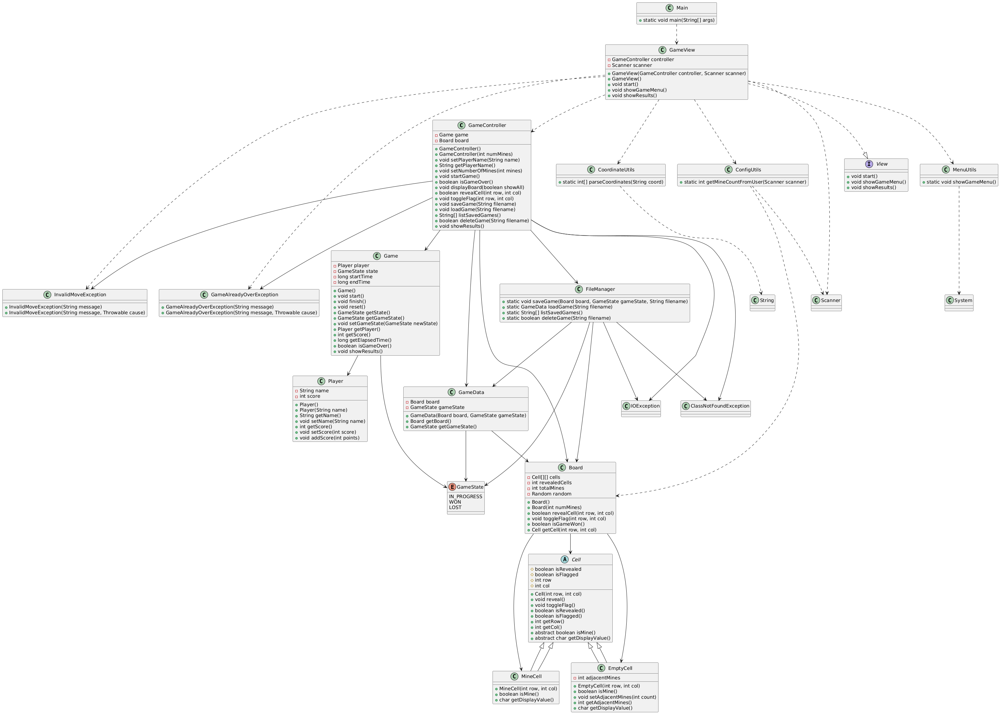

# Minesweeper (Buscaminas)

## Autores
- Nombres: Mónica Guillermo, Carlos Marca, Aidan Flores 
- Estudiantes de segundo ciclo de la carrera de Ingeniería de Software
- **Universidad Politécnica Salesiana**

---

## Resumen
Este proyecto es una implementación en Java del clásico juego Buscaminas, jugable por consola. Permite al usuario descubrir casillas, marcar banderas, guardar y cargar partidas, y visualizar el estado del juego. El diseño sigue principios de orientación a objetos y separación de responsabilidades.

---

## Estructura del Proyecto
La estructura está organizada en paquetes que agrupan las clases según su función:

```
saves/
    partida_backup.minesweeper
    partida_demo.minesweeper
src/
    controller/
        GameController.java
    exceptions/
        GameAlreadyOverException.java
        InvalidMoveException.java
    main/
        Main.java
    model/
        Board.java
        Cell.java
        EmptyCell.java
        Game.java
        GameState.java
        MineCell.java
        Player.java
    persistence/
        FileManager.java
        GameData.java
    utils/
        ConfigUtils.java
        CoordinateUtils.java
        MenuUtils.java
    view/
        GameView.java
        View.java
```
---

## Relación entre Clases
- **Main**: Punto de entrada, inicia la vista principal.
- **GameView**: Interfaz de usuario, interactúa con el usuario y el controlador.
- **View**: Interfaz para desacoplar la vista del controlador.
- **GameController**: Controla la lógica principal, gestiona el flujo del juego, conecta la vista con el modelo.
- **Game**: Representa el estado y lógica del juego, gestiona el jugador y el tiempo.
- **Player**: Almacena información del jugador (nombre, puntaje).
- **Board**: Representa el tablero, gestiona las celdas y la lógica de revelado/marcado.
- **Cell (abstracta)**: Base para las casillas del tablero.
    - **MineCell**: Casilla con mina.
    - **EmptyCell**: Casilla vacía, puede tener minas adyacentes.
- **GameState (enum)**: Estados posibles del juego (IN_PROGRESS, WON, LOST).
- **FileManager**: Gestiona la persistencia (guardar/cargar partidas).
- **GameData**: Estructura serializable para guardar el estado del juego.
- **ConfigUtils**: Utilidad para configuración y validación de minas.
- **CoordinateUtils**: Utilidad para validar y convertir coordenadas.
- **MenuUtils**: Utilidad para mostrar el menú de opciones.
- **Excepciones**: Manejan errores específicos del juego.
    - **InvalidMoveException**: Movimiento inválido.
    - **GameAlreadyOverException**: Acción en juego terminado.
---

## Características
- Juego Buscaminas por consola.
- Guardado y carga de partidas.
- Validación de movimientos y coordenadas.
- Menú interactivo y mensajes claros.
- Diagrama de clases
- Separación clara entre vista, controlador, modelo y utilidades.
- Pruebas unitarias en la carpeta `test/`.

## Diagrama de Clases
El archivo `img/diagrama_de_clases.png` contiene el diagrama de clases del proyecto en formato PNG.

A continuación se muestra una vista previa del diagrama de clases generado para este sistema:



---

## Instrucciones para Clonar y Ejecutar el Proyecto
1. Abre una terminal o consola de comandos.
2. Clona el repositorio ejecutando:
   ```bash
   git clone https://github.com/cmarca26/proyecto-minesweeper
   cd proyecto-minesweeper
   ```
3. Abre el proyecto en tu IDE favorito y compílalo como un proyecto Java estándar.
4. Ejecuta la clase principal `Main` para iniciar el simulador.
5. (Opcional) Ejecuta las clases de prueba ubicadas en la carpeta `test` para validar el funcionamiento.
---

## Notas Adicionales
- El proyecto está diseñado para facilitar la extensión y el mantenimiento.
- El tablero y la cantidad de minas son configurables.
- Las partidas guardadas se almacenan en la carpeta `saves/`.
- El diagrama de clases ayuda a comprender la arquitectura y relaciones entre componentes.
- Para ejecutar el juego, compila y ejecuta `Main.java`.

---

